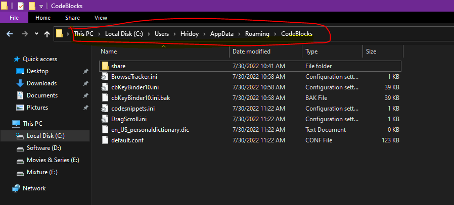
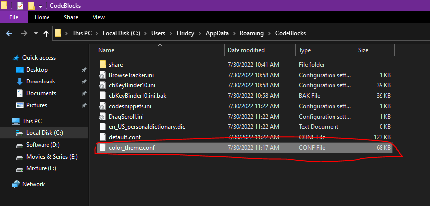
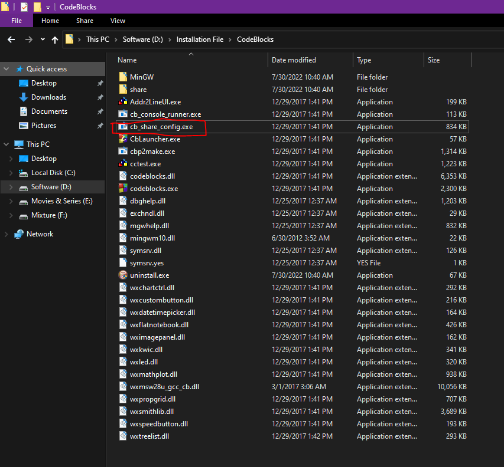
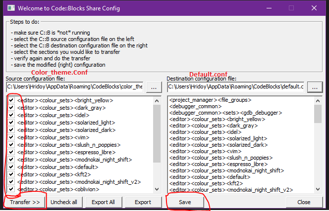
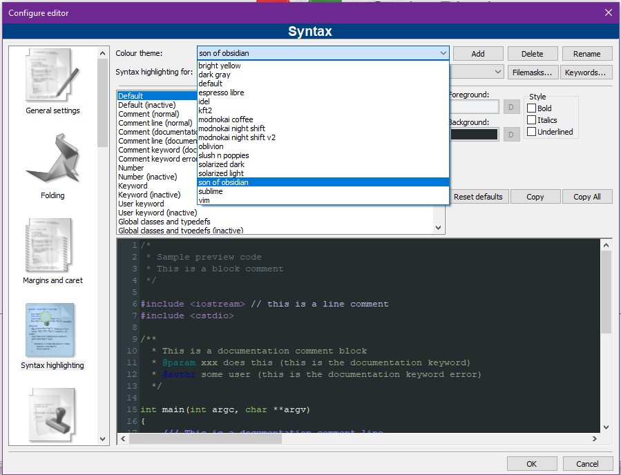

## Codeblock-Colorful-Theme
Codeblock is one of the most popular ide for c/c++, but the problem is it has a very limited theme and it's really irritating to work in such a light environment. Furthermore, it humpers the programmer's eyes. Wouldn't it be great if you could use a customized theme to decorate it like VSCode and other IDEs? Let's Do it Then.

## Steps 

Download [color_theme.conf]() From The Repository
1. Make Sure CodeBlock is ClOSED before making any CHANGES
2. Make sure to hit SAVE when doing the transfer
3. If you can't find your default.conf most likely codeblocks is running, KILL it 

Then Follow These Each Step Properly 

   
     
   <b>Go To This Address According To Your Codeblock Appdata Directory </b> 
     
    <b>Copy Theme File To This Directory</b> 
     
    <b>Then Go To Codeblock Installation Directory And Open Marked File</b> 
     
    <b>In Left Open Theme.conf and In Right Open Defult.conf Then Mark Everything And Click Transfer Then Save It</b> 
     
    <b>Now Open Codeblock And See All The Beautiful Theme</b> 

